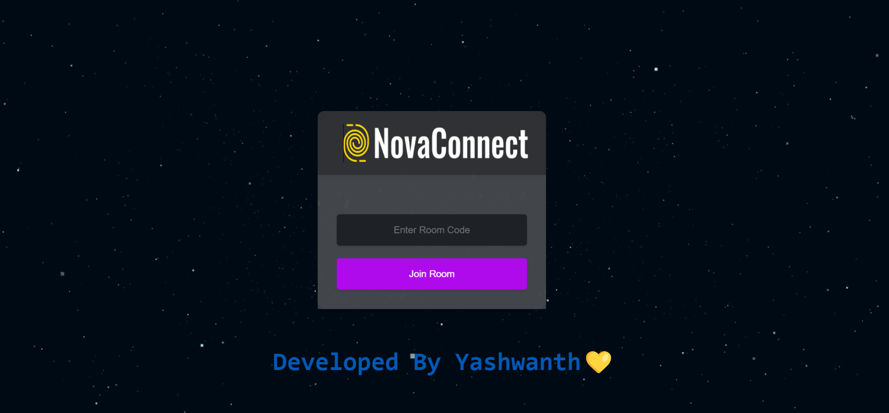

# NovaConnect - Your Ultimate Realtime HD Video Calling App

Welcome to NovaConnect, where you can experience crystal-clear HD video calls designed for seamless communication. Follow these easy steps to elevate your video calling experience:

## How to Use NovaConnect:

1. **Connect to WIFI:**
   Ensure a stable connection for high-quality HD calls.

2. **Open the Link:**
   Open the following link in your browser: [NovaConnect Dashboard](https://yashwanthvarma18.github.io/NovaConnect/DashBoard.html)

3. **Enter the Code:**
   - Create a unique video calling room with a personalized code.
   - Share the code with others to connect.
   - Join an existing room by entering the code.

4. **Grant Permissions:**
   Allow access to video and audio for a complete experience.

5. **Control Mic and Video:**
   Manage your preferences with easy-to-use buttons.
   - Green for ON 🟢
   - Red for OFF 🔴

6. **End Call:**
   Click the red "End Call" button to conclude your video call. ✖

7. **Troubleshoot with Refresh:**
   If any issues arise, simply refresh the page. ⚠

## Enjoy the Magic of HD Video Calling with NovaConnect! 🚀 

Don't forget to hit the "Like" button if you love the app - your support means the world to us. ❤ 

Thank you for choosing NovaConnect! 🌈📞

